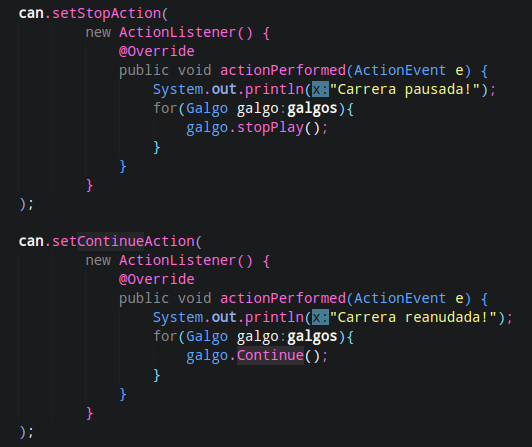
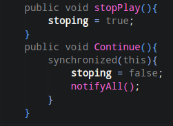
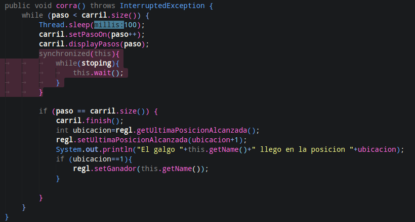

Escuela Colombiana de Ingeniería

Arquitecturas de Software – ARSW


## ESTUDIANTES: NICOLÁS CASTRO JARAMILLO Y SERGIO ANDRES GONZALES

####Taller – programación concurrente, condiciones de carrera y sincronización de hilos. EJERCICIO INDIVIDUAL O EN PAREJAS.

#####Parte I – Antes de terminar la clase.

Creación, puesta en marcha y coordinación de hilos.

1. Revise el programa “primos concurrentes” (en la carpeta parte1), dispuesto en el paquete edu.eci.arsw.primefinder. Este es un programa que calcula los números primos entre dos intervalos, distribuyendo la búsqueda de los mismos entre hilos independientes. Por ahora, tiene un único hilo de ejecución que busca los primos entre 0 y 30.000.000. Ejecútelo, abra el administrador de procesos del sistema operativo, y verifique cuantos núcleos son usados por el mismo.


*Con un hilo, la ejecucion demoro 4 minutos con 8 segundos, el equipo donde se ejecutó el programa posee 4 núcleos y 8 procesadores lógicos, durante todo el proceso los 4 núcleos de la CPU fueron utilizados y el uso total de la CPU oscilaba entre 80-100%, una velocidad entre 3,50 a 3,90 gigaheartz. Esto indica que el equipo realizo un trabajo intenso al ejecutar el programa ya que el sistema estaba funcionando a su máxima capacidad. Los picos en algunos de los procesadores se deben a que se optimizaba la CPU durante toda la ejecucion*


2. Modifique el programa para que, en lugar de resolver el problema con un solo hilo, lo haga con tres, donde cada uno de éstos hará la tarcera parte del problema original. Verifique nuevamente el funcionamiento, y nuevamente revise el uso de los núcleos del equipo.

```

public class Main {

	public static void main(String[] args) {
		
		PrimeFinderThread pft1=new PrimeFinderThread(0, 10000000);
		PrimeFinderThread pft2=new PrimeFinderThread(10000001, 20000000);
		PrimeFinderThread pft3=new PrimeFinderThread(20000001, 30000000);
		
		pft1.start();
		pft2.start();
		pft3.start();

		
		
	}
	
}

```


*A pesar de que se demoró casi el mismo tiempo de ejecucion, 4 minutos con 20 segundos, El uso de la CPU rondaba entre el 20 y el 50% durante la mayor parte de la ejecucion, debido a que el código corría de manera concurrente Podemos ver que cada núcleo trabaja casi a la misma intensidad pero de manera bastante reducida comparando cuando lo ejecutamos con un solo hilo*


3. Lo que se le ha pedido es: debe modificar la aplicación de manera que cuando hayan transcurrido 5 segundos desde que se inició la ejecución, se detengan todos los hilos y se muestre el número de primos encontrados hasta el momento. Luego, se debe esperar a que el usuario presione ENTER para reanudar la ejecución de los mismo.


```
package edu.eci.arsw.primefinder;

import java.util.LinkedList;
import java.util.List;

public class PrimeFinderThread extends Thread{
	int a,b;
	// variable running, indica si el o los hilos estan en ejecucion
	boolean running = true;

	private List<Integer> primes=new LinkedList<Integer>();
	
	public PrimeFinderThread(int a, int b) {
		super();
		this.a = a;
		this.b = b;
	}
	// metodo que indica si el hilo esta en ejecucion, es syncronized para evitar conflictos,
	//si la variable es false se pone en espera
	public synchronized void isRunning(){
		while (!running){
			try {
				wait();
			} catch (InterruptedException e) {
				e.printStackTrace();
			}
		}
	}

	public void run(){
		for (int i=a;i<=b;i++){						
			if (isPrime(i)){
				primes.add(i);
				System.out.println(i);
				isRunning();
			}
		}
	}
	
	boolean isPrime(int n) {
	    if (n%2==0) return false;
	    for(int i=3;i*i<=n;i+=2) {
	        if(n%i==0)
	            return false;
	    }
	    return true;
	}

	public List<Integer> getPrimes() {
		return primes;
	}
	
	public void pause(){
		running = false;
	}

	public String information(){
		return getName() + " " + primes.size();
	}
	// metodo que convierte running en true y despierta a todos los hilos.
	public synchronized void again(){
		running = true;
		notifyAll();
	}
	
}

```

```
package edu.eci.arsw.primefinder;

import java.util.ArrayList;
import java.util.Objects;
import java.util.Scanner;

public class Main {

	public static void main(String[] args) {
		long startTime = System.currentTimeMillis();
		String input = "";
        long elapsedTime;

		ArrayList<PrimeFinderThread> threads = new ArrayList<>();

		PrimeFinderThread pft1=new PrimeFinderThread(0, 9999999);
		PrimeFinderThread pft2=new PrimeFinderThread(10000000, 19999999);
		PrimeFinderThread pft3=new PrimeFinderThread(20000000, 30000000);
		
		threads.add(pft1);
		threads.add(pft2);
		threads.add(pft3);

		for(PrimeFinderThread thread:threads){
			thread.start();
		}
		//Controlamos la pausa y la reanudacion de los hilos
		try (Scanner scanner = new Scanner(System.in)) {
			while(Objects.equals(input, "")){
				//Calculamos el tiempo transcurrido, esperamos a que hallan pasado 5 segundos
				do {elapsedTime = System.currentTimeMillis() - startTime;} while (elapsedTime < 5000); 
				for(PrimeFinderThread thread:threads){
					System.out.println(thread.information());
				}
				for(PrimeFinderThread thread:threads){
					thread.pause();
				}
				// Se espera que el ususario oprima enter para reanudar los hilos
				System.out.println("Oprima enter");
				input = scanner.nextLine();
				// Reanudamos todos los hilos
				for(PrimeFinderThread thread:threads){
					thread.again();
				}
				//Actualizamos el valor de startTime
				startTime = System.currentTimeMillis();
			}
		}

	}

	
}

```


#####Parte II 


Para este ejercicio se va a trabajar con un simulador de carreras de galgos (carpeta parte2), cuya representación gráfica corresponde a la siguiente figura:


En la simulación, todos los galgos tienen la misma velocidad (a nivel de programación), por lo que el galgo ganador será aquel que (por cuestiones del azar) haya sido más beneficiado por el *scheduling* del
procesador (es decir, al que más ciclos de CPU se le haya otorgado durante la carrera). El modelo de la aplicación es el siguiente:


Como se observa, los galgos son objetos ‘hilo’ (Thread), y el avance de los mismos es visualizado en la clase Canodromo, que es básicamente un formulario Swing. Todos los galgos (por defecto son 17 galgos corriendo en una pista de 100 metros) comparten el acceso a un objeto de tipo
RegistroLLegada. Cuando un galgo llega a la meta, accede al contador ubicado en dicho objeto (cuyo valor inicial es 1), y toma dicho valor como su posición de llegada, y luego lo incrementa en 1. El galgo que
logre tomar el ‘1’ será el ganador.

Al iniciar la aplicación, hay un primer error evidente: los resultados (total recorrido y número del galgo ganador) son mostrados antes de que finalice la carrera como tal. Sin embargo, es posible que una vez corregido esto, haya más inconsistencias causadas por la presencia de condiciones de carrera.

Taller.

1.  Corrija la aplicación para que el aviso de resultados se muestre
    sólo cuando la ejecución de todos los hilos ‘galgo’ haya finalizado.
    Para esto tenga en cuenta:

    a.  La acción de iniciar la carrera y mostrar los resultados se realiza a partir de la línea 38 de MainCanodromo.

    b.  Puede utilizarse el método join() de la clase Thread para sincronizar el hilo que inicia la carrera, con la finalización de los hilos de los galgos.


2.  Una vez corregido el problema inicial, corra la aplicación varias
    veces, e identifique las inconsistencias en los resultados de las
    mismas viendo el ‘ranking’ mostrado en consola (algunas veces
    podrían salir resultados válidos, pero en otros se pueden presentar
    dichas inconsistencias). A partir de esto, identifique las regiones
    críticas () del programa.


*Podemos ver que el programa funciona pero tiene varias inconsistencias como puestos que se repite o que la salida no muestra el orden correcto y la cantidad de galgos no es la correcta debido a esto*


*Como region critica tenemos En el método corra de la clase Galgo, accede a regl para actualizar la última posición alcanzada y verificar si el galgo es el ganador.*

3.  Utilice un mecanismo de sincronización para garantizar que a dichas
    regiones críticas sólo acceda un hilo a la vez. Verifique los
    resultados.


4.  Implemente las funcionalidades de pausa y continuar. Con estas,
    cuando se haga clic en ‘Stop’, todos los hilos de los galgos
    deberían dormirse, y cuando se haga clic en ‘Continue’ los mismos
    deberían despertarse y continuar con la carrera. Diseñe una solución que permita hacer esto utilizando los mecanismos de sincronización con las primitivas de los Locks provistos por el lenguaje (wait y notifyAll).

	R/. se crean las funciones stopPlay() y Continue() estas se implementan en un ciclo for para que todos los galgos paren o continúen según se requiera

	

	Las funciones stopPlay() y Continue():

	

	El funcionamiento de estas se realiza gracias a una variable booleana llamada stoping la cual se valida en la función corra del código y de ser verdadera detiene el hilo:

	


## Criterios de evaluación

1. Funcionalidad.

    1.1. La ejecución de los galgos puede ser detenida y resumida consistentemente.
    
    1.2. No hay inconsistencias en el orden de llegada registrado.
    
2. Diseño.   

    2.1. Se hace una sincronización de sólo la región crítica (sincronizar, por ejemplo, todo un método, bloquearía más de lo necesario).
    
    2.2. Los galgos, cuando están suspendidos, son reactivados son sólo un llamado (usando un monitor común).

